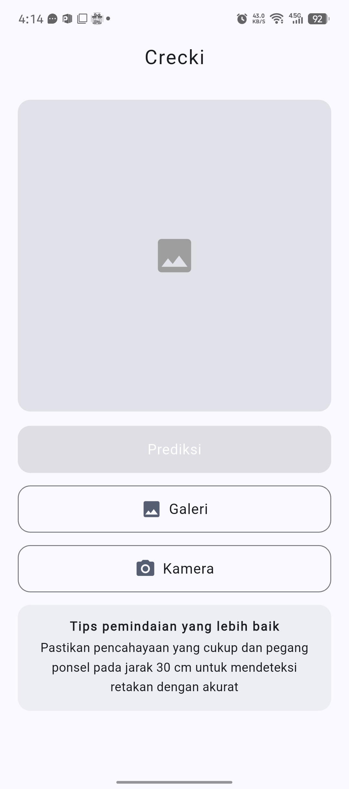
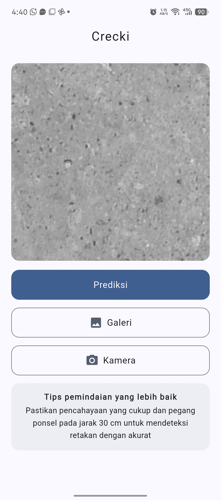
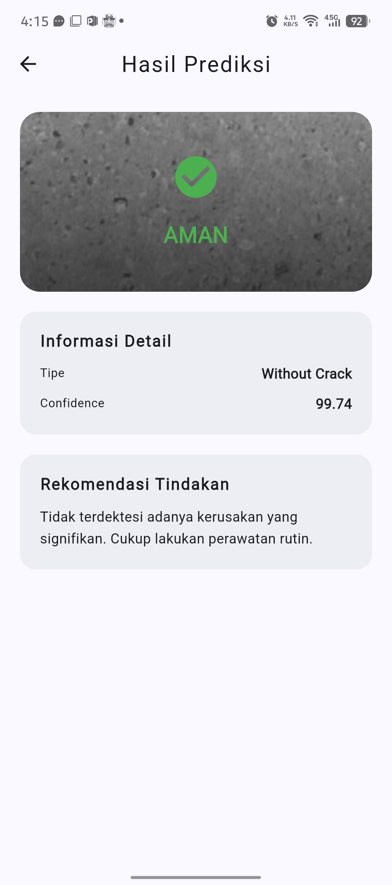
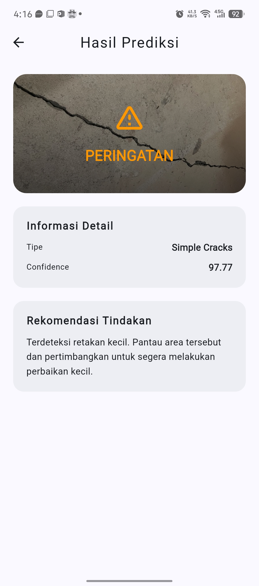
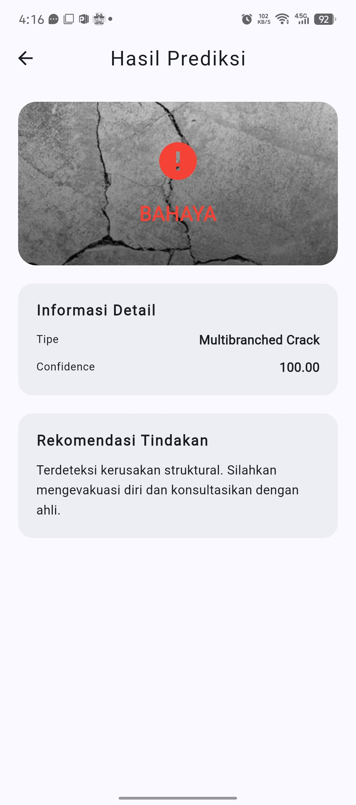

# Crecki – Aplikasi Manajemen Keuangan Pintar

## Ringkasan Eksekutif

### Masalah

Mengelola keuangan pribadi di era ekonomi digital yang serba cepat menjadi semakin kompleks. Banyak pengguna terjebak dalam "invisible spending" (pengeluaran tak terlihat)—pengeluaran kecil namun sering yang tidak tercatat—yang berujung pada kondisi finansial yang buruk dan kesulitan mencapai target menabung jangka panjang. Solusi yang ada saat ini seringkali terkendala oleh proses sinkronisasi yang lambat, sulitnya akses data antar perangkat secara terpusat, atau antarmuka yang terlalu rumit sehingga menghambat efisiensi pengguna dalam memantau pengeluaran mereka secara real-time.

### Solusi

**Extrak** dikembangkan untuk menjembatani celah antara analisis keuangan yang kuat dan pengalaman pengguna yang praktis. Dengan memanfaatkan rendering engine Flutter yang berkinerja tinggi serta arsitektur berbasis Cloud-Native yang terintegrasi secara mulus, aplikasi ini menyediakan:

* **Umpan Balik Instan:** Input data dengan latensi rendah untuk mencatat pengeluaran tepat di saat pembelian dilakukan.
* **Wawasan Berbasis Data:** Mengubah log transaksi mentah menjadi visualisasi anggaran yang informatif dan siap ditindaklanjuti.
* **Integritas Data Terpusat:** Menjamin keamanan dan konsistensi data melalui validasi server-side, sehingga pengguna dapat mengakses informasi keuangan mereka yang paling mutakhir kapan saja dan di mana saja.

---

## 📸 Tangkapan Layar Aplikasi


| Halaman Utama | Halaman Utama ketika terdapat gambar |
| --- | --- |
|  |  |

| Hasil Prediksi Aman | Hasil Prediksi Peringatan | Hasil Prediksi Bahaya |
| --- | --- | --- |
|  |  |  |

---

## Fitur Utama
* **Model Canggih:** Model yang digunakan adalah MobileNetV2 yang ringan dan memiliki performa cepat untuk diintegrasikan pada perangkat seperti smartphone. Model ini juga telah dilatih untuk mengklasifikasikan 3 jenis yaitu tanpa retakan (Without Crack), retakan simpel (Simple Crack) dan retakan dengan cabang (MultiBranched Crack)
* **Performa Cepat:** performa cepat, dengan proses prediksi kurang dari 1 detik.
* **Offline:** Tidak perlu akses internet, sehingga aplikasi ini bisa dipakai ketika terjadi bencana dan akses internet mati. 
---

## 🛠 Tech Stack (Teknologi)

* **Frontend:** Flutter (Dart)
* **State Management:** BLoC – *Dipilih karena transisi state yang dapat diprediksi dan kemudahan dalam pengujian.*
* **:** [misal: Firebase / Node.js + Express]
* **Database:** [misal: PostgreSQL / Firestore]
* **Dependency Injection:** [misal: GetIt / Riverpod]
* **Local Storage:** [misal: Hive]

---

## 🏗 Arsitektur Sistem & Alur Data

Proyek ini mengikuti prinsip **Clean Architecture** untuk memastikan basis kode dapat ditingkatkan (*scalable*), mudah diuji (*testable*), dan tidak bergantung pada *framework* eksternal.

### Struktur Folder

* `models/`: Representasi objek data dan parsing JSON.
* `providers/`: Pengelola *state* dan logika bisnis.
* `screens/`: Antarmuka pengguna utama.
* `services/`: Komunikasi API dan layanan eksternal.
* `utils/`: Fungsi pembantu, konstanta, dan tema.
* `widgets/`: Komponen UI yang dapat digunakan kembali.

---

## 🔐 Integrasi Backend & Autentikasi

* **Autentikasi (Supabase Auth):** Menggunakan layanan autentikasi bawaan Supabase (GoTrue) untuk manajemen sesi yang aman. Mendukung alur kerja pendaftaran, masuk, dan pengelolaan profil pengguna dengan keamanan tingkat tinggi.

* **Integrasi Database (PostgreSQL):** Memanfaatkan SDK resmi supabase_flutter untuk melakukan operasi CRUD (Create, Read, Update, Delete) langsung ke database PostgreSQL melalui PostgREST API yang efisien.

* **Manajemen Sesi Otomatis:** Mengimplementasikan pendengar status autentikasi (Auth State Listener) untuk menangani perubahan status login pengguna secara reaktif dan otomatis.
---

## 🧠 Keputusan Teknis & Trade-offs

### Mengapa Riverpod?

Saya memilih Riverpod sebagai solusi state management karena sifatnya yang compile-safe dan fleksibel. Berbeda dengan Provider standar, Riverpod meminimalisir kesalahan runtime dan memungkinkan pembagian logika bisnis yang lebih modular. Hal ini sangat krusial dalam aplikasi keuangan untuk memastikan sinkronisasi data antar widget (seperti saldo dan daftar transaksi) tetap konsisten tanpa adanya kebocoran memori atau pembaruan state yang tidak perlu.

### Pilihan Database: Supabase (PostgreSQL)

saya memilih Supabase dengan PostgreSQL. Keputusan ini didasarkan pada:

* Relational Data Integrity: Data keuangan sangat bergantung pada relasi (misal: kategori transaksi dengan riwayat pengeluaran). SQL memungkinkan kueri yang kompleks dan memastikan integritas data melalui foreign keys.

* Real-time Synchronization: Memungkinkan aplikasi untuk selalu menampilkan data terbaru secara instan di berbagai perangkat tanpa perlu melakukan refresh manual.

* Scalability: Memastikan aplikasi siap menangani pertumbuhan data pengguna yang besar di sisi server dengan keamanan tingkat tinggi.

---

## ⚙️ Persiapan & Instalasi

Ikuti langkah-langkah berikut untuk menjalankan proyek secara lokal:

1. **Prasyarat:** - Flutter SDK sudah terinstal (`flutter doctor` harus menunjukkan status hijau).
* [misal: Setup proyek Firebase / Server Node.js sudah berjalan].


2. **Klon repositori:**
```bash
git clone https://github.com/usernameanda/expense-tracker.git
cd expense-tracker

```


3. **Instal dependensi:**
```bash
flutter pub get

```


4. **Jalankan aplikasi:**
```bash
flutter run

```